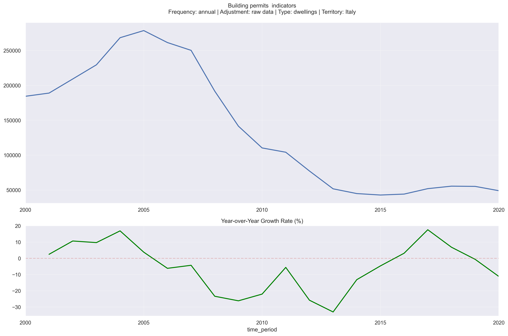
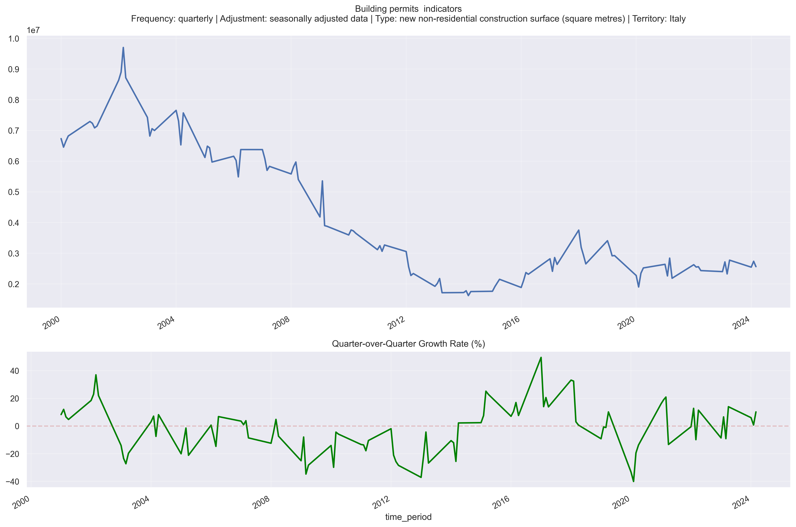
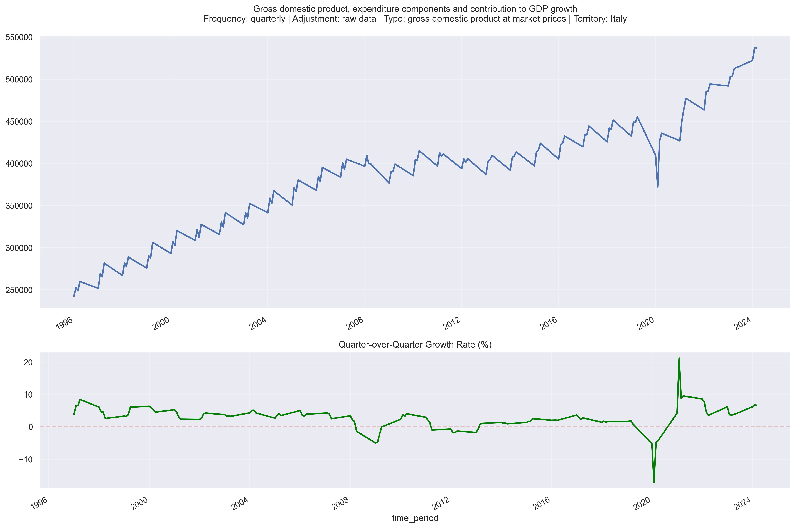
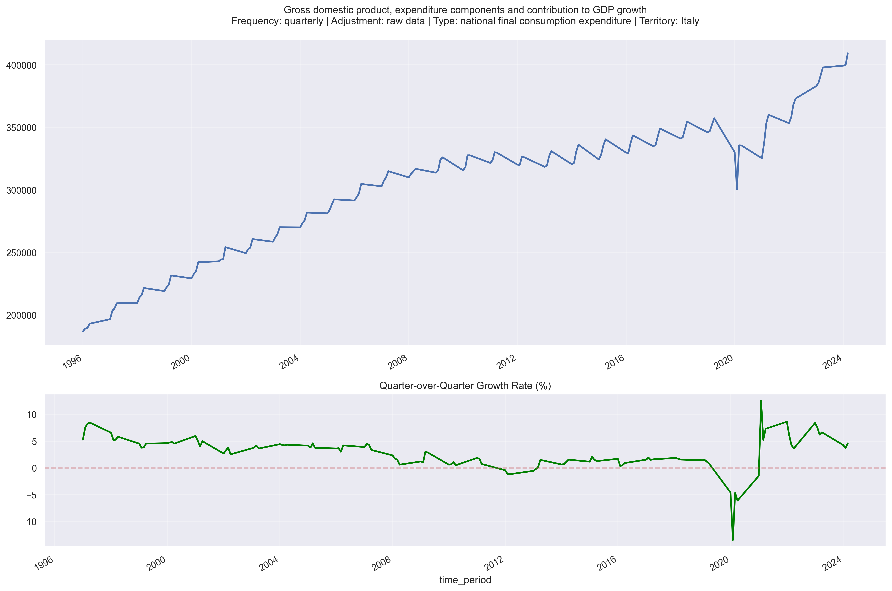

# ISTAT Fundamental Data Analysis Toolkit

A comprehensive toolkit for extracting, processing, and visualizing Italian economic data from ISTAT (Italian National Institute of Statistics) through their SDMX API.

## Directory Structure

```
ISTAT_FundamentalData/
├── src/
│   ├── IstatMapping.py              # Creates mappings from SDMX API
│   ├── ISTATavailableconstraintsbuilder.py  # Extracts dataset constraints
│   ├── ISTATDataextractorfromdatasetID.py   # Creates time series from dataset
│   └── ISTAT_Time_Serie_Plotter.py          # Visualizes time series data
├── data/
│   ├── constraints/                 # Stores dataset constraints
│   ├── mappings/                   # Stores API mappings
│   └── series_data/                # Stores extracted time series
└── img/                            # Generated visualizations
```

## Workflow

### 1. Dataset Discovery
First, users need to identify the dataset they want to analyze:
1. Navigate to the ISTAT SDMX API URL: `http://sdmx.istat.it/SDMXWS/rest/dataflow/IT1`
2. Browse the available datasets through the API response
3. Note down the Dataset ID of interest

The API follows SDMX 2.1 standards and provides access to all ISTAT datasets. Here are some key API endpoints:
- Dataset list: `http://sdmx.istat.it/SDMXWS/rest/dataflow/IT1`
- Dataset structure: `http://sdmx.istat.it/SDMXWS/rest/datastructure/IT1/<dataset_id>`
- Data query: `http://sdmx.istat.it/SDMXWS/rest/data/<dataset_id>`

### 2. Create Dataset Mappings
Use `IstatMapping.py` to create the necessary mappings:
```python
python src/IstatMapping.py --dataset_id YOUR_DATASET_ID
```
This script will:
- Navigate through the SDMX API URLs
- Create dictionary mappings for the dataset
- Store mappings in `data/mappings/`

### 3. Extract Dataset Constraints
Use `ISTATavailableconstraintsbuilder.py` to get dataset-specific constraints:
```python
python src/ISTATavailableconstraintsbuilder.py --dataset_id YOUR_DATASET_ID
```
This will:
- Extract all available constraints for the specified dataset
- Create detailed constraint descriptions
- Save constraints to `data/constraints/`

### 4. Generate Time Series
Use `ISTATDataextractorfromdatasetID.py` to create time series:
```python
python src/ISTATDataextractorfromdatasetID.py --dataset_id YOUR_DATASET_ID
```
This script will:
- Navigate the SDMX API for the specified dataset
- Parse JSON files from constraints and mappings
- Create time series with descriptions
- Save series data to `data/series_data/`

### 5. Visualize Data
Finally, use `ISTAT_Time_Serie_Plotter.py` to create visualizations:
```python
python src/ISTAT_Time_Serie_Plotter.py
```
This will:
- Read time series from `data/series_data/`
- Create detailed plots with metadata
- Save visualizations to `img/`

## Requirements
- Python 3.8+
- pandas
- matplotlib
- seaborn
- requests
- pathlib

## Installation
1. Clone the repository:
```bash
git clone https://github.com/AntonioPavoni/FundamentalData.git
cd FundamentalData/ISTAT_FundamentalData
```

2. Install required packages:
```bash
pip install pandas matplotlib seaborn requests
```

## Example Usage
Here's a complete example workflow:

1. Find a dataset ID (e.g., "115_362" for Industrial Production):
```python
# First create mappings
python src/IstatMapping.py --dataset_id 115_362

# Then extract constraints
python src/ISTATavailableconstraintsbuilder.py --dataset_id 115_362

# Generate time series
python src/ISTATDataextractorfromdatasetID.py --dataset_id 115_362

# Finally, create visualizations
python src/ISTAT_Time_Serie_Plotter.py
```

## Output
- Mapping files are saved in `data/mappings/`
- Constraint files are saved in `data/constraints/`
- Time series data is saved in `data/series_data/`
- Visualizations are saved in `img/`

### Sample Visualizations

Here are some example visualizations generated by the toolkit:

#### Building Permits Indicators

*Annual Building Permits Data*


*Quarterly Building Permits Surface Index*

#### GDP and Economic Indicators

*Quarterly GDP at Market Prices*


*GDP Components Analysis*

These visualizations demonstrate the toolkit's ability to handle different types of economic indicators, frequencies (quarterly and annual), and data transformations. Each plot includes:
- Main time series trend
- Year-over-year growth rates
- Comprehensive metadata
- Data source information

## Notes
- All scripts use proper error handling and logging
- The toolkit is designed to work with any ISTAT dataset
- Visualizations include comprehensive metadata and descriptions

## Contributing
Contributions are welcome! Please feel free to submit a Pull Request.

## License
This project is licensed under the MIT License - see the LICENSE file for details.
